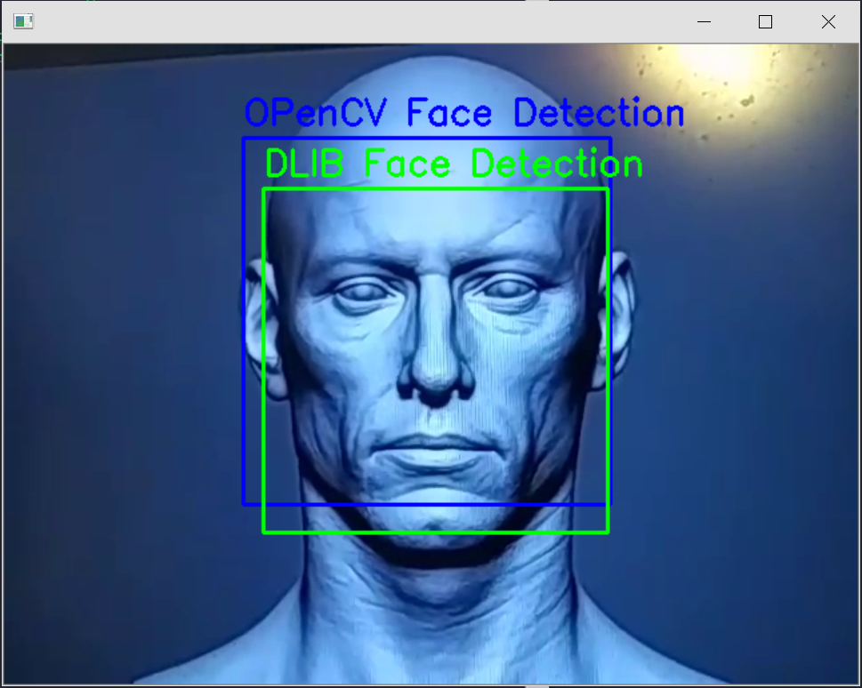
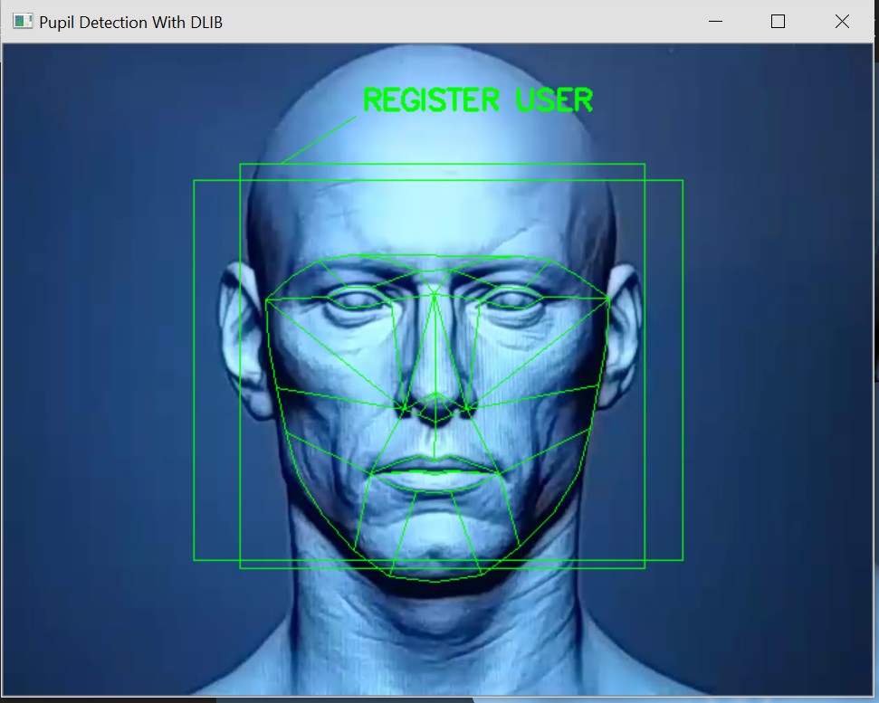
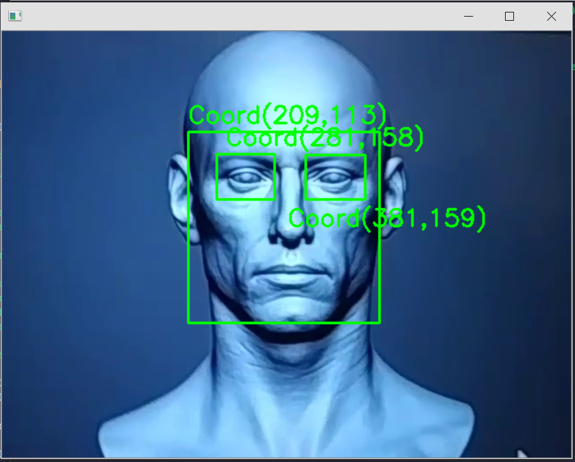
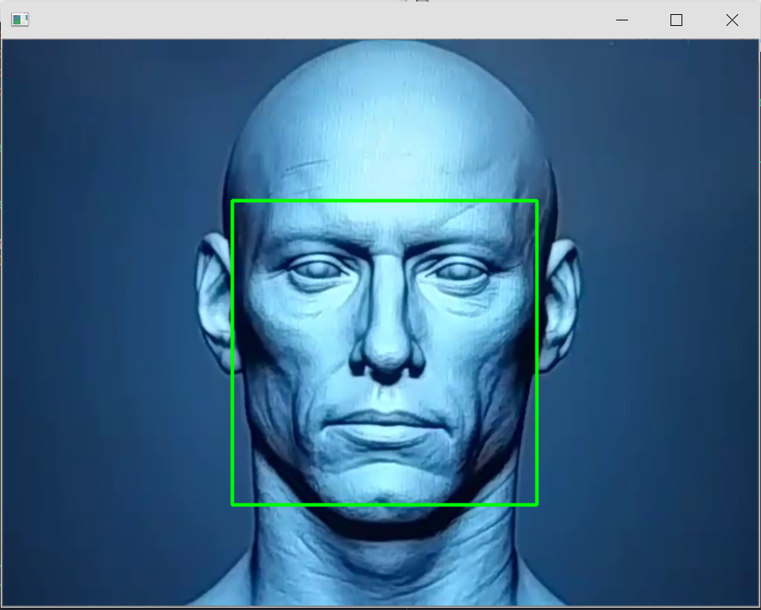
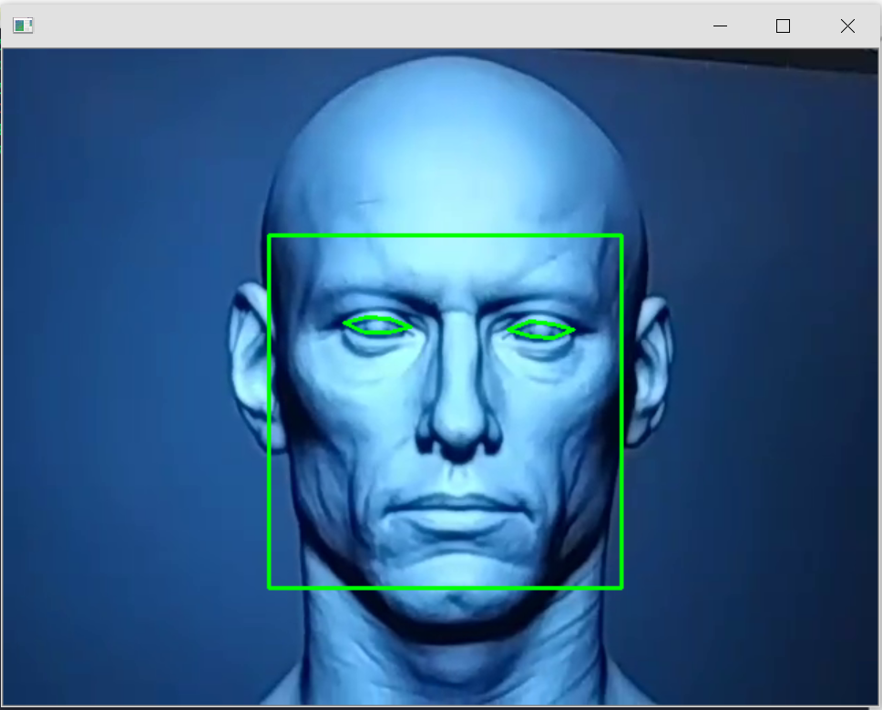
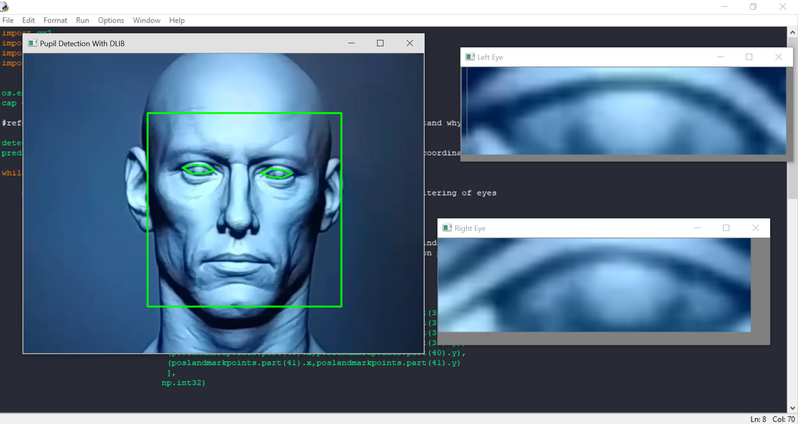
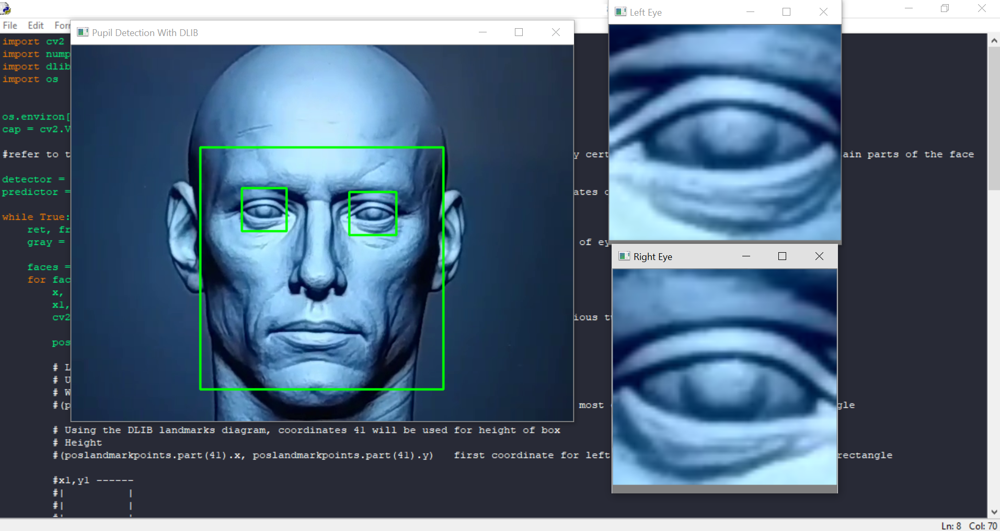

# Facial-Recognition-Tracking-Computer-Vision-Python

A comparative assesment on computer recognition tracking libraries, specifically DLIB and OpenCV's Haar Cascade Classifiers. The program DlibVsOpenCVFaceDetection.py compares the DLIB face detector to Haar cascades facial detection at the same time, specifically the Haar feature-based cascade classifiers. In terms of facial recognition and detection, DLIB's library for face dectection is shown to be more precise out of the two.

A few other examples have been included to compare the two libraries detection methods:

